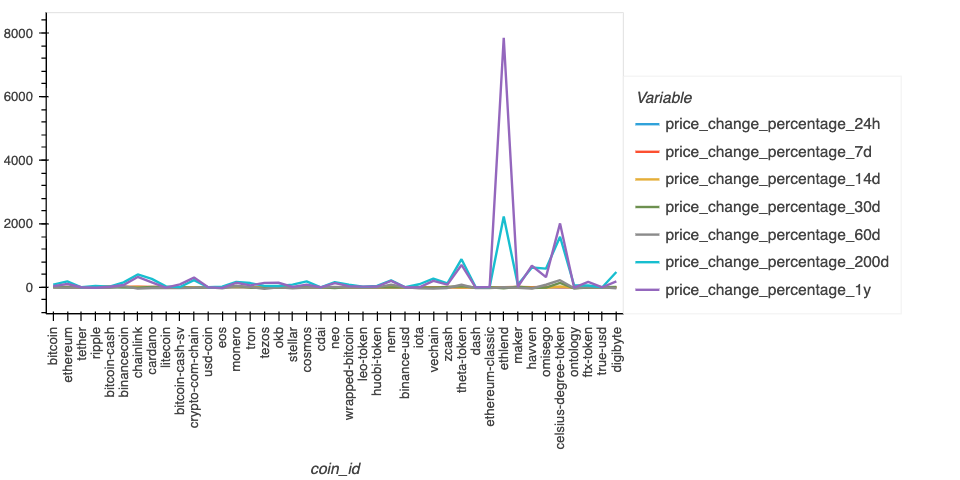
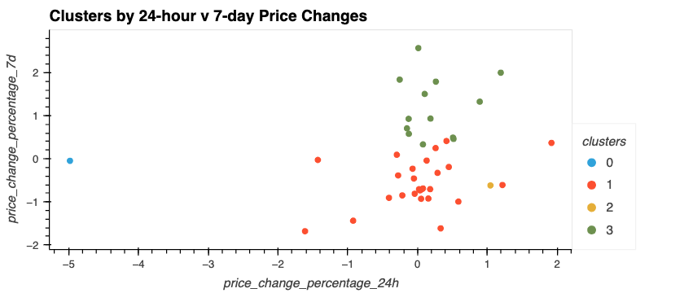

# Crypto Clustering
## Unsupervised Learning Prediction of CryptoCurrency

### Load and Preview Summary of Data
Load the `crypto_market_data.csv` into a DataFrame.
Preview Summary Statistics and Plot the Data to gain insight of dataset before proceeding.

### Prepare the Data
Using the StandardScaler() module from scikit-learn I normalized the data from the CSV file.
Created a DataFrame with the scaled data and set the "coin_id" index from the original DataFrame as the index for the new DataFrame.

### Find the Best Value for k using the Original Scaled DataFrame
Used the elbow method to find the best value for `k` using the following steps:
#### Created a list with the number of k values from 1 to 11.
#### Created an empty list to store the inertia values.
#### Created a `for` loop to compute the inertia with each possible value of `k`.
#### Created a dictionary with the data to plot the elbow curve.
#### Plotted a line chart with all inertia values computed with the different values of `k` to visually identify the optimal value for `k`.
#### Documented the best value for `k`.

### Cluster Cryptocurrencies with K-means Model using the Original Scaled Data
* Used the following steps to cluster the cryptocurrencies for the best value for `k` on the original scaled data:
 * Initialized the K-means model with the best value for `k`.
 * Fit the K-means model using the original scaled DataFrame.
 * Predicted the clusters to group the cryptocurrencies using the original scaled DataFrame.
 * Created a copy of the original data and added a new column with the predicted clusters.
#### Created a scatter plot using hvPlot as follows:
* Set the x & y axes as `x="price_change_percentage_24h"` and `y="price_change_percentage_7d"`, respectively.
* Colored the graph points with the labels found using K-Means.
* Added the crypto name in the `hover_cols` parameter to identify the cryptocurrency represented by each data point.

### Optimized the Clusters with Principal Component Analysis
* Used the original scaled DataFrame, to perform a PCA and reduced the features to three principal components.
* Retrieved the explained variance to determine how much information can be attributed to each principal component and then provided insight and explanation on the total explained variance of the three principal components.